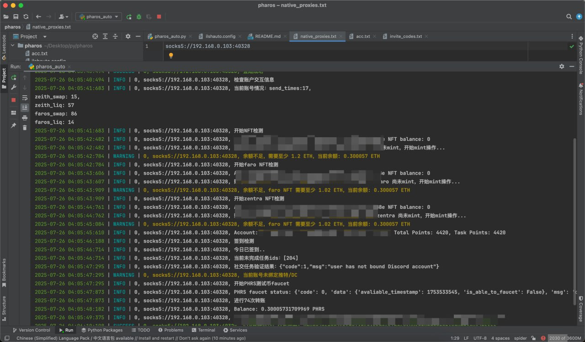

# Pharos Testnet Season1
分享一下 Pharos Season1 部分任务的交互脚本

PS: 出现问题询问GPT为先，无法解决可到我的推特 Pharos推文下给我留言：https://x.com/hashlmBrian/status/1948850286501773621

## ilsh_run.config 配置说明
```commandline
{
"daily_check": true, %签到任务 true开启，false不开启
"faucet_phrs": true, %PHRS 领水 true开启，false不开启
"mint_nft": true, %mint所有nft true开启，false不开启
"faroswap": true, % faroswap任务 true开启，false不开启
"send_to_friends": true, %send_to_friends任务 true开启，false不开启
"zenith_liq": true %zenith_liq任务 true开启 false不开启
"batch_size": 10, %每批运行账号数
"round_delay": 1, %每轮睡眠之间x小时
}
```
## 运行说明
```commandline
[注意使用GPT]
1. acc.txt 中填写助记词，一行一个账号
2. native_proxies.txtx 中填写代理，一行一个(推荐使用socks5)
3. pip install -r requirements.txt
4. 运行pharos_auto.py (python pharos_auto.py)
```
## 运行效果


## 社交网络
```commandline
推特：https://x.com/hashlmBrian
TG频道：t.me/ilsh_auto
```

## 其他
```commandline
基础工具:
    验证码自动化工具：https://yescaptcha.com/i/ekPowU

机场:
贵、好、节点多: https://tagss.pro/#/auth/jcQGZ32l
便宜够用: https://login.ouonetwork.com/register?aff=pWUbQHLm
代理工具: 
		mac、win均推荐: clash verge, 下载链接: https://github.com/clash-verge-rev/clash-verge-rev/releases/tag/v2.3.2
		安卓推荐:hiddify, 下载链接: https://github.com/hiddify/hiddify-app

动态代理(需要外网环境运行, 购买前一定要先试用, 判断自己的环境是否能用):
https://www.stormproxies.cn/?invite=E9SASX

指纹浏览器: 
  注意事项: 指纹浏览器会出现被盗情况，注意安全！！
	比特浏览器:https://www.bitbrowser.cn/?code=192cb1


！！！跑后端脚本的账号，容易女巫，放平心态，作为冲量使用。准备一些账号跑前端脚本/手动操作。
```
